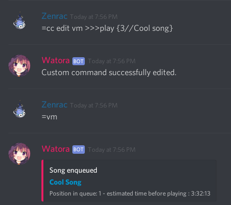

# Custom Commands


Custom Commands are [Rich Commands](rich-commands.md).  
It's highly recommended to read the [Rich Commands page](rich-commands.md) before reading this page.


## Custom Commands Basics

### Manage Custom Commands

To manage custom commands on your server you have to use `customcommand` \(or `cc`\)

| Usage | Help |
| :--- | :--- |
| **`cc add [command] [content]`** | Allows to add a custom command on the server.  |
| **`cc edit [command] [content]`** | Allows to edit a custom command on the server.  |
| **`cc delete [command]`** | Allows to remove a custom command from the server.  |
| **`cc list`** | Displays the custom commands list. |
| **`cc raw [command]`** | Displays the real content of a custom command. |

**Example :**


### Creating a allias

To create an alias you can use the fact that [you can call a command](rich-commands.md#you-can-call-a-command) with Rich Commands.



When creating the custom command, you can specify a static parameter for the command, for example`>>>roll 10`will call `roll 10`when using`k` 


### Commands which doesn't need any parameter

Here's an example of a russian roulette which either play an earrape, or a relaxing song.


### Mixing two commands together

You can call several commands thanks to`&&`

**Example :**


* Every variables mentionned in [Rich Commands](rich-commands.md)

## Custom Commands Advanced

### How to get user's parameter

If you don't want a static parameter, you can ask the user to give one.

| Number | Effect |
| :--- | :--- |
| **`x`** | Empty. |
| **`&`** | Same than`0`but without counting quotations |
| **`0`** | Gives every words. |
| **`1`** | Gives the first word. |
| **`2`** | Gives the second word. |
| **`3`** | Gives the third word. |
| ... | ... |


Using quotations between a group of words allows to get several words instead of taking one by one word.  
  
**Example :**   
`cmd "This is a test" Hello "Help please"`  
{1} = This is a test  
{2} = Hello  
{3} = Help please


**Example :**



By default, if you only specify `>>>volume`without`{1}`it's the same thing than `>>>volume {0}` it means that every parameters are taken, when`{1}`only takes the first one.


### Conditions

You can set a default value when failing to catch a value.

**Example :**



### Others

#### You can select several parameters based on their index. 

**Example :**

```text
cmd This is an example

{1:3} = This is an
{-1} = example
{-1:-2} = example an
```


You can use negative number to start counting from the end


